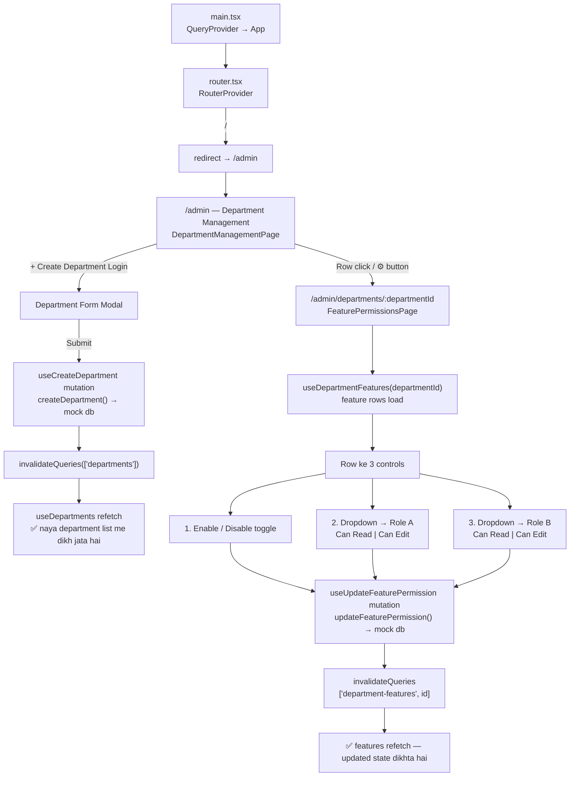
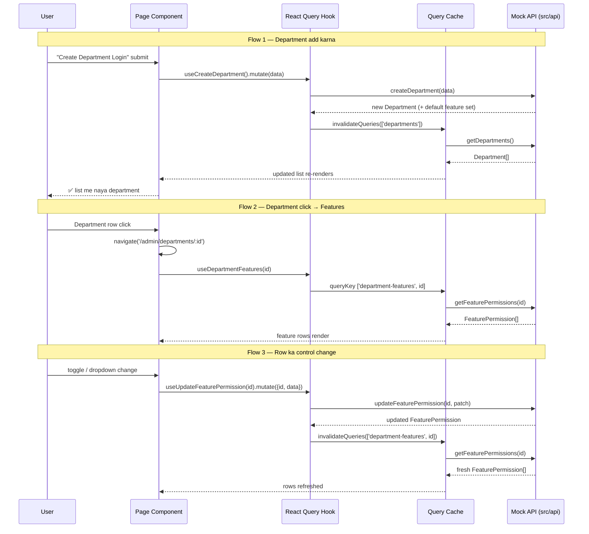

# PROJECT.MD — SMSF Admin Portal

Department management aur feature-level role permissions ke liye admin panel.
Routing **TanStack Router**, data fetching/caching **TanStack Query** se hoti hai.

---

## Tech Stack

| Concern | Library |
|---|---|
| UI | React 19 + TypeScript (Vite) |
| Routing | `@tanstack/react-router` (code-based, `src/app/router.tsx`) |
| Server state | `@tanstack/react-query` v5 |
| Data layer | `src/api/*` — abhi **mock in-memory store**, real API ke liye `apiRequest` (fetch) ready hai |
| Styling | Plain CSS (`src/index.css`) |

---

## Routes

| Path | Kya dikhata hai | Component |
|---|---|---|
| `/` | `/admin` par redirect | `beforeLoad` redirect |
| `/admin` | Department list + **Add Department** button + stats/search | `DepartmentManagementPage` |
| `/admin/departments/$departmentId` | Us department ki **feature list** (row ke end me 3 controls) | `FeaturePermissionsPage` |

Root route `AdminLayout` (sidebar + content) wrap karta hai — dono pages sidebar ke saath render hote hain.

---

## Folder Structure

```
src/
├── app/
│   ├── router.tsx                  # Routes: / → /admin → /admin/departments/:id
│   ├── queryClient.ts              # QueryClient singleton (staleTime 30s)
│   └── providers/QueryProvider.tsx # QueryClientProvider wrapper
├── api/
│   ├── client.ts                   # fetch wrapper + ApiError (real API ke liye)
│   ├── departments.api.ts          # get/create/update/delete department (mock)
│   ├── feature-permissions.api.ts  # get/update feature permissions (mock)
│   └── mock/db.ts                  # In-memory store + seed data
├── features/
│   ├── departments/
│   │   ├── pages/DepartmentManagementPage.tsx   # /admin
│   │   ├── components/DepartmentTable.tsx       # row click → features
│   │   └── hooks/useDepartments.ts              # queryKey: ['departments']
│   └── permissions/
│       ├── pages/FeaturePermissionsPage.tsx     # /admin/departments/:id
│       ├── components/FeaturePermissionsTable.tsx
│       └── hooks/
│           ├── useDepartmentFeatures.ts         # queryKey: ['department-features', id]
│           └── useUpdateFeaturePermission.ts    # mutation + invalidate
└── components/layout/             # AdminLayout + AdminSidebar
```

---

## User Flow



---

## Data Flow (TanStack Query)



**Conventions**

- Query key read hook me export hoti hai (`departmentsQueryKey`, `departmentFeaturesQueryKey(id)`), mutation hooks wahi import karke `invalidateQueries` karte hain.
- Mutations me retry 0, queries me retry 1, `staleTime: 30_000` (`src/app/queryClient.ts`).
- UI side-effects (modal close) page se `.mutate(data, { onSuccess })` se hote hain; cache invalidation hook ke andar.

---

## Feature Row Controls

Har feature row ke **end me 3 controls**:

| # | Control | UI | Mutation field | Options |
|---|---|---|---|---|
| 1 | Enable / Disable | Toggle switch | `enabled` | on / off |
| 2 | Role A permission | Dropdown | `roleAPermission` | `Can Read`, `Can Edit` |
| 3 | Role B permission | Dropdown | `roleBPermission` | `Can Read`, `Can Edit` |

- Feature **disabled** ho to dono dropdowns bhi disable ho jate hain (permission sirf enabled feature par lagti hai).
- Row ke control update ke dauran sirf wahi control disable hota hai (`updatingFeatureId`).
- Har update ek independent mutation hai — invalidation ke baad poori list refetch hoti hai.

---

## Mock Data Layer

Abhi koi backend nahi hai, isliye API functions ek in-memory store (`src/api/mock/db.ts`) par chalte hain:

- Seed: 2 departments (Finance, Operations), har department ke liye 8 default features
  (Dashboard, Reports, User Management, Billing, Audit Log, Settings, Notifications, Data Export).
- Naya department banate hi uske liye default feature set auto-seed hota hai.
- Department delete karne par uske feature permissions bhi delete hote hain (cascade).
- Har call pehle `delay()` se simulated network latency (250–300 ms) leta hai.

**Real API me swap karne ke liye:** `src/api/departments.api.ts` aur
`src/api/feature-permissions.api.ts` ke andar function bodies ko wapas
`apiRequest('/endpoint', {...})` calls se replace karein — signatures same hain,
hooks/pages ko bilkul change nahi karna padega. Base URL:
`VITE_API_BASE_URL` (default `http://localhost:3000/api`), wrapper `src/api/client.ts` me hai.

---

## Commands

```bash
npm run dev     # dev server
npm run build   # tsc -b && vite build
npm run lint    # eslint
```
