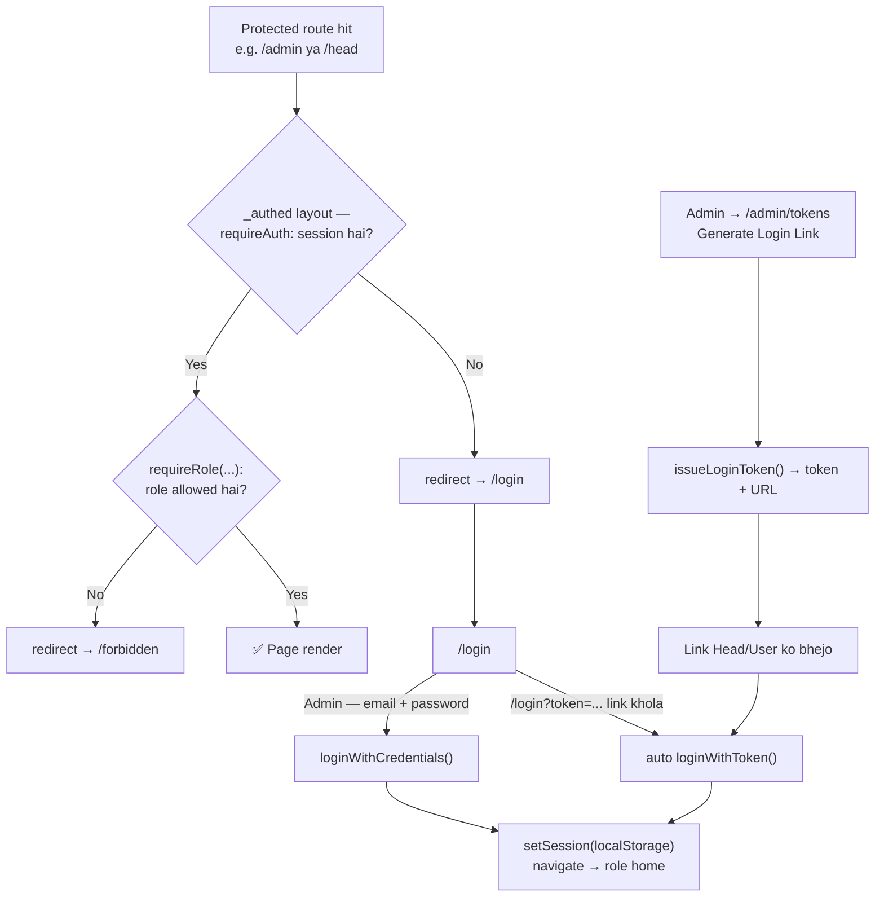
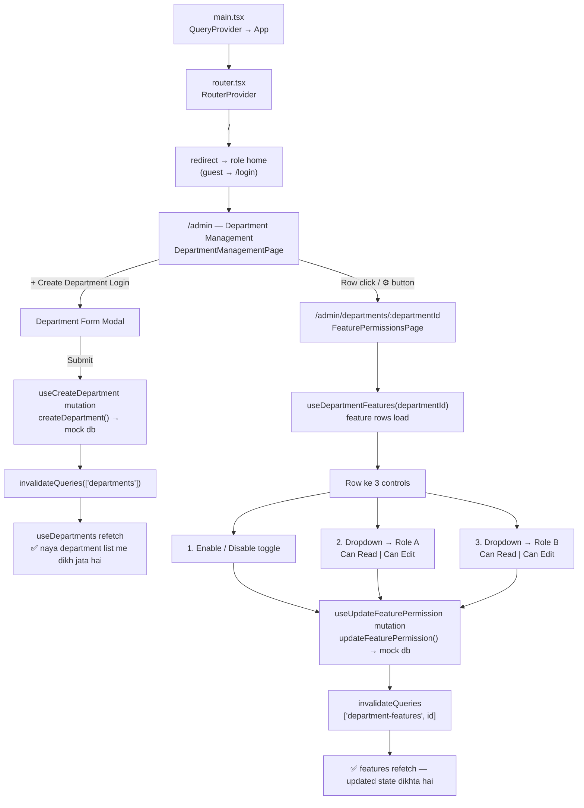
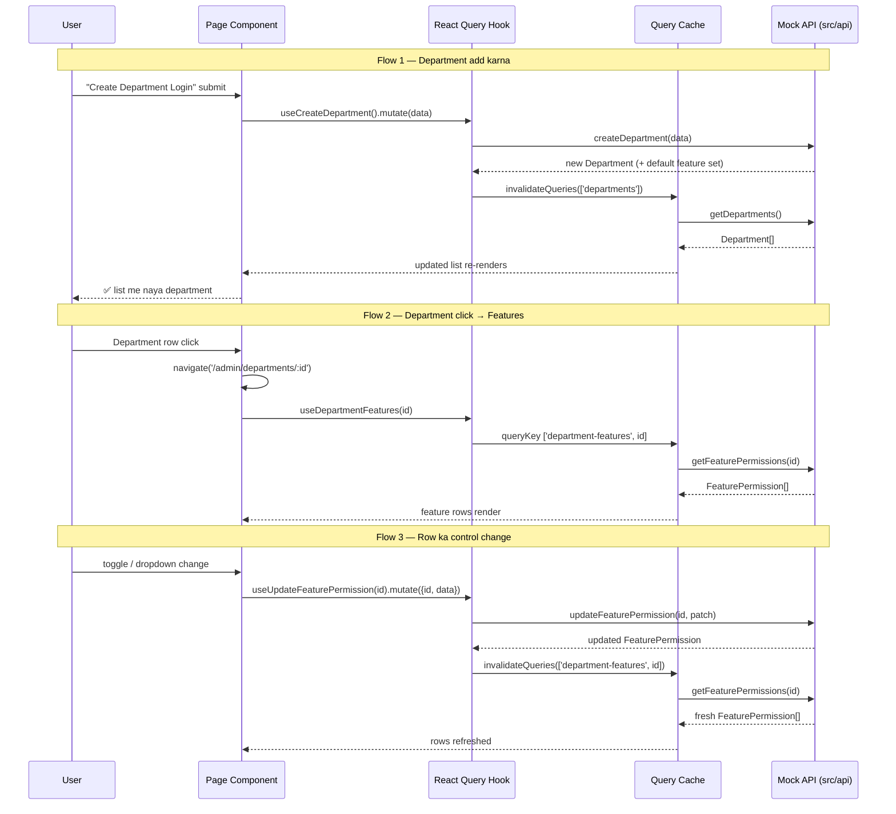

# PROJECT.MD — SMSF Admin Portal

Department management aur feature-level role permissions ke liye admin panel.
Routing **TanStack Router**, data fetching/caching **TanStack Query**, auth/role
checking **router middleware** (`beforeLoad`) se hoti hai.

---

## Tech Stack

| Concern | Library |
|---|---|
| UI | React 19 + TypeScript (Vite) |
| Routing | `@tanstack/react-router` (code-based, `src/app/router.tsx`) |
| Server state | `@tanstack/react-query` v5 |
| Data layer | `src/api/*` — abhi **mock in-memory store**, real API ke liye `apiRequest` (fetch) ready hai |
| Styling | **Hybrid** — purana UI plain CSS (`src/index.css`), naya UI **Tailwind CSS v4** (`@tailwindcss/vite`) |

---

## Routes

| Path | Access | Kya dikhata hai | Component |
|---|---|---|---|
| `/` | — | Role ke home (`/admin` / `/head` / `/users`), warna `/login` redirect | `beforeLoad` redirect |
| `/login` | Public (guest) | Admin login (email + password) + magic access link se auto-login | `LoginPage` |
| `/admin` | **ADMIN** | Department list + **Add Department** button + stats/search | `DepartmentManagementPage` |
| `/admin/departments/$departmentId` | **ADMIN** | Department ki feature list (row ke end me 3 controls) | `FeaturePermissionsPage` |
| `/admin/tokens` | **ADMIN** | Head/User ke liye **magic login link** issue / revoke | `AccessTokensPage` |
| `/head` | **ADMIN, HEAD** | Route stub — real page aane tak placeholder | `pendingPage('Head Panel')` |
| `/users` | **ADMIN, HEAD, USER** | Route stub — USER ka dashboard (page aane tak placeholder) | `pendingPage('Users')` |
| `/forbidden` | Logged-in | 403 — role ke paas route access nahi | `ForbiddenPage` |

**Middleware** (`src/app/middleware/auth.middleware.ts`):

- `_authed` layout route har protected route par pehle `requireAuth` chalata hai —
  session nahi mila to `/login` redirect.
- Uske baad har route par `requireRole(...)` — role allow list me nahi to
  `/forbidden` redirect.
- `/login` par ulta check: pehle se logged-in hai to apne role ke home par redirect.
- `/head` aur `/users` abhi sirf routes hain (permission check test karne ke liye) —
  inke real pages/components baad me provide honge; tab router me sirf
  `component` swap karna hoga, guards waise ke waise rahenge.

---

## Folder Structure

```
src/
├── app/
│   ├── router.tsx                  # Routes + route guards (beforeLoad)
│   ├── middleware/auth.middleware.ts # requireAuth + requireRole (yehi "middleware" hai)
│   ├── auth/session.ts             # localStorage session + homeForRole()
│   ├── queryClient.ts              # QueryClient singleton (staleTime 30s)
│   └── providers/QueryProvider.tsx # QueryClientProvider wrapper
├── api/
│   ├── client.ts                   # fetch wrapper + ApiError (real API ke liye)
│   ├── departments.api.ts          # get/create/update/delete department (mock)
│   ├── feature-permissions.api.ts  # get/update feature permissions (mock)
│   ├── auth.api.ts                 # login, issue/revoke token (mock)
│   └── mock/
│       ├── db.ts                   # Departments + features store + seed
│       └── auth.db.ts              # Users + issued tokens store, token generator
├── features/
│   ├── auth/
│   │   ├── types/auth.types.ts     # UserRole, AuthSession, IssuedLoginToken
│   │   ├── pages/LoginPage.tsx     # /login
│   │   ├── pages/ForbiddenPage.tsx # /forbidden
│   │   ├── pages/AccessTokensPage.tsx # /admin/tokens
│   │   ├── components/             # IssueTokenTable, IssuedTokensTable
│   │   ├── hooks/                  # login, users, issue/revoke token hooks
│   │   └── utils/loginLink.ts      # buildLoginLink() → /login?token=...
│   ├── departments/
│   │   ├── pages/DepartmentManagementPage.tsx   # /admin
│   │   ├── components/DepartmentTable.tsx       # row click → features
│   │   └── hooks/useDepartments.ts              # queryKey: ['departments']
│   └── permissions/
│       ├── pages/FeaturePermissionsPage.tsx     # /admin/departments/:id
│       ├── components/FeaturePermissionsTable.tsx
│       └── hooks/
│           ├── useDepartmentFeatures.ts         # queryKey: ['department-features', id]
│           └── useUpdateFeaturePermission.ts    # mutation + invalidate
└── components/layout/             # AdminLayout + AdminSidebar (role-based nav)
```

---

## Auth & Middleware

**Roles:** `ADMIN`, `HEAD`, `USER` — strict matrix:

| Route | ADMIN | HEAD | USER |
|---|---|---|---|
| `/admin`, `/admin/departments/:id`, `/admin/tokens` | ✅ | ❌ | ❌ |
| `/head` | ✅ | ✅ | ❌ |
| `/users` | ✅ | ✅ | ✅ |
| `/forbidden` | ✅ | ✅ | ✅ |

- **Session** localStorage me (`smsf.auth.session`) — fake-JWT token + user.
- **Admin login:** `admin@smsf.test` / `admin123` (email + password form).
- **Head/User login (magic link):** admin `/admin/tokens` par **login link**
  generate karta hai → Head/User woh link kholte hi auto-login hoke seedha
  apne dashboard par pahunchte hain (`/head` ya `/users`). Link me token
  query param me hota hai: `/login?token=...`.
- Link tab tak valid hai jab tak admin revoke na kare (one-time use nahi);
  manual token paste wala fallback bhi `/login` par maujood hai.
- USER role ka home `/users` hai.



---

## User Flow



---

## Data Flow (TanStack Query)



**Conventions**

- Query key read hook me export hoti hai (`departmentsQueryKey`, `departmentFeaturesQueryKey(id)`), mutation hooks wahi import karke `invalidateQueries` karte hain.
- Mutations me retry 0, queries me retry 1, `staleTime: 30_000` (`src/app/queryClient.ts`).
- UI side-effects (modal close) page se `.mutate(data, { onSuccess })` se hote hain; cache invalidation hook ke andar.

---

## Styling Conventions (Hybrid CSS + Tailwind)

**Rule: purane components me plain CSS classes, naye UI me Tailwind utilities.**

- Setup (Tailwind **v4**, config-file free):
  1. devDep: `tailwindcss` + `@tailwindcss/vite`
  2. `vite.config.ts` me `tailwindcss()` plugin
  3. `src/index.css` ki **pehli line**: `@import "tailwindcss";`
- Naye pages (`/head`, `/users`, aane wale naye screens) Tailwind utilities se
  banao — jaldi hota hai.
- **Gotchas:**
  - v4 me Tailwind **cascade layers** use karta hai → hamari custom CSS
    (unlayered) hamesha utilities ko override karti hai. Matlab purani
    classes (`.nav-item`, `.table-wrapper`, ...) ke upar utility class se
    override nahi hoga — mixing karte waqt dhyan do.
  - Tailwind **preflight** base reset karta hai (margins, button/input
    defaults); purani custom CSS unhe override kar leti hai — purane screens
    par asar nahi hona chahiye, but major change ke baad ek baar visual
    check kar lena.
  - `src/App.css` orphan hai (Vite template ka), koi import nahi karta.
- Jab pura UI ek din rewrite ho, tabhi full Tailwind migration sochna
  (abhi dono saath me rakhna hi plan hai).

---

## Feature Row Controls

Har feature row ke **end me 3 controls**:

| # | Control | UI | Mutation field | Options |
|---|---|---|---|---|
| 1 | Enable / Disable | Toggle switch | `enabled` | on / off |
| 2 | Role A permission | Dropdown | `roleAPermission` | `Can Read`, `Can Edit` |
| 3 | Role B permission | Dropdown | `roleBPermission` | `Can Read`, `Can Edit` |

- Feature **disabled** ho to dono dropdowns bhi disable ho jate hain (permission sirf enabled feature par lagti hai).
- Row ke control update ke dauran sirf wahi control disable hota hai (`updatingFeatureId`).
- Har update ek independent mutation hai — invalidation ke baad poori list refetch hoti hai.

---

## Mock Data Layer

Abhi koi backend nahi hai, isliye API functions ek in-memory store (`src/api/mock/db.ts`) par chalte hain:

- Seed: 2 departments (Finance, Operations), har department ke liye 8 default features
  (Dashboard, Reports, User Management, Billing, Audit Log, Settings, Notifications, Data Export).
- Naya department banate hi uske liye default feature set auto-seed hota hai.
- Department delete karne par uske feature permissions bhi delete hote hain (cascade).
- Har call pehle `delay()` se simulated network latency (250–300 ms) leta hai.

**Real API me swap karne ke liye:** `src/api/departments.api.ts` aur
`src/api/feature-permissions.api.ts` ke andar function bodies ko wapas
`apiRequest('/endpoint', {...})` calls se replace karein — signatures same hain,
hooks/pages ko bilkul change nahi karna padega. Base URL:
`VITE_API_BASE_URL` (default `http://localhost:3000/api`), wrapper `src/api/client.ts` me hai.

---

## Commands

```bash
npm run dev     # dev server
npm run build   # tsc -b && vite build
npm run lint    # eslint
```

**Current status (07 Oct 2026):** `npm run build` ✅ (0 errors) · `npm run lint` ✅ (0 errors, 0 warnings).

---

## Recovery & Restore Log (07 Oct 2026)

Ek git `stash` + remote merge ne kai tracked files ko purane (remote) versions par revert kar diya tha aur kuch files delete kar di thi. Neeche sab restore hua:

**Recreate kiye gaye files (purani content se):**

| File | Kya hai |
|---|---|
| `src/App.tsx` | `RouterProvider` wrapper (AdminLayout wala purana version hataya) |
| `src/api/departments.api.ts` | mock in-memory CRUD (fetch/`apiRequest` wapas nahi) |
| `src/api/mock/db.ts` | departments + feature store + seed |
| `src/api/feature-permissions.api.ts` | get/update feature permissions (mock) |
| `src/features/permissions/types/permission.types.ts` | `FeaturePermission`, `PermissionLevel` |
| `src/features/permissions/hooks/useDepartmentFeatures.ts` | query `['department-features', id]` |
| `src/features/permissions/hooks/useUpdateFeaturePermission.ts` | mutation + invalidate |
| `src/features/permissions/components/FeaturePermissionsTable.tsx` | feature rows + toggle + dropdowns |
| `src/features/departments/hooks/useDepartments.ts` | query `['departments']` + export key |

**Re-apply kiye gaye edits (reverted files par wapas):**

- `DepartmentTable.tsx` — `onViewFeatures` prop, row click → features, ⚙ button (stopPropagation)
- `DepartmentManagementPage.tsx` — `useNavigate`, `handleViewFeatures`, `onViewFeatures` prop, `departments` ko `useMemo` me
- `DepartmentFormModal.tsx` — `useEffect` reset ki jagah render-phase `wasOpen` fix
- `LoginPage.tsx` — `handleSessionCreated` ko `useCallback` me wrap (lint warning)
- `router.tsx` / `index.css` — merge conflict markers already hataye the; dono ab clean hain

**Restore ke baad:** build + lint dono green.

---

## Pending Work

1. **Git index abhi unmerged hai** — `git status` me `UU`/`DU`/`MM` entries pending hain (`router.tsx`, `index.css`, `PROJECT.MD`, `FeaturePermissionsPage.tsx`, `AdminSidebar.tsx`). User ko khud resolve karke commit karna hai (AI commit nahi karega). Ek purana stash bhi `stash@{0}` par pada hai.
2. **`/head` aur `/users` ke real pages** — abhi `pendingPage(...)` stubs hain; user pages dega to sirf router me `component` swap hoga, guards waise ke waise rahenge.
3. **Stray file:** `src/features/departments/Haed/page.tsx` — user ne banayi hai (abhi empty, naam me typo `Haed`); hataani/karna user decide karega.
